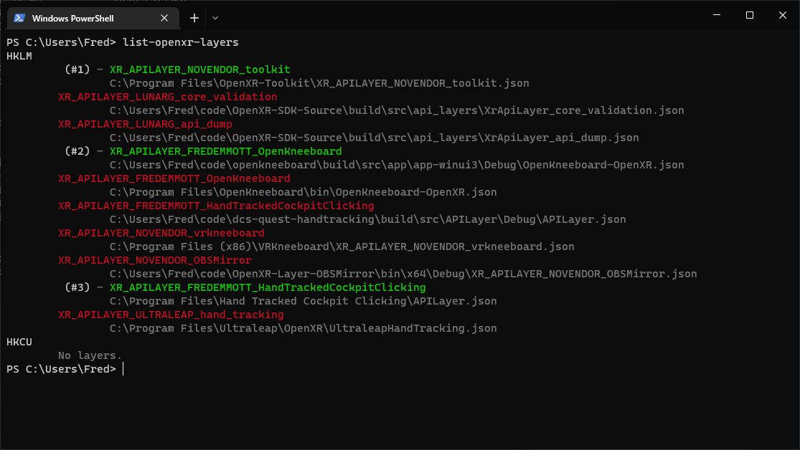

# list-openxr-layers

This is a small PowerShell script for listing OpenXR API layers, in load order, and whether or not they're active.

It is a debugging tool, originally part of [Hand Tracked Cockpit Clicking](https://github.com/fredemmott/hand-tracked-cockpit-clicking).

# License

This script is licensed under [the MIT license](LICENSE).
